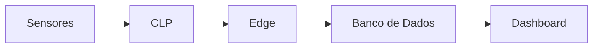

# 🏭 Industrial Data Automation Lab

> Repositório profissional de estudos em **Automação Industrial, IoT e Coleta de Dados em Tempo Real**.

---

## 🚀 Visão Geral

Este projeto simula um ambiente industrial completo, com:

* 📡 Sensores (temperatura, pressão, nível, vibração)
* 🧠 Lógica de controle (CLP)
* 📊 Dashboard (visualização de dados)
* 🗄️ Armazenamento e análise

Objetivo: desenvolver competências práticas em **Indústria 4.0**.

---

## 🧱 Arquitetura do Sistema



---

## 📊 Dashboard (Exemplo)

https://www.intergate.net.br/blog/sematex-e-industria-4-0-lancamento-na-febratex-2018/

---

## 📈 Gráficos de Monitoramento

### Temperatura


### Pressão


### Vibração


---

## ⚙️ Tecnologias Utilizadas

* Python 🐍
* JavaScript 🌐
* Chart.js 📊
* MQTT (simulado)
* Node.js (opcional)

---

## 🧠 Funcionalidades

* Monitoramento em tempo real
* Detecção de anomalias
* Sistema de alertas
* Simulação de sensores industriais
* Dashboard interativo

---

## 📂 Estrutura do Projeto

```bash
project/
 ├── python/
 ├── javascript/
 ├── dashboard/
 └── docs/
```

---

## 🧪 Exemplos de Uso

```python
sensor = Sensor("TEMP-01", "temperatura", "°C", 0, 100)
valor = sensor.ler()
print(valor)
```

---

## 📡 Roadmap

* [x] Simulação de sensores
* [x] Dashboard web
* [ ] Integração com banco de dados
* [ ] API REST
* [ ] Deploy em nuvem

---

## 📸 Demonstração


---

## 👨‍💻 Autor

Projeto desenvolvido para estudos em automação industrial e programação.

---

## ⭐ Contribuição

Sinta-se livre para contribuir com melhorias!

---

## 📜 Licença

MIT License
